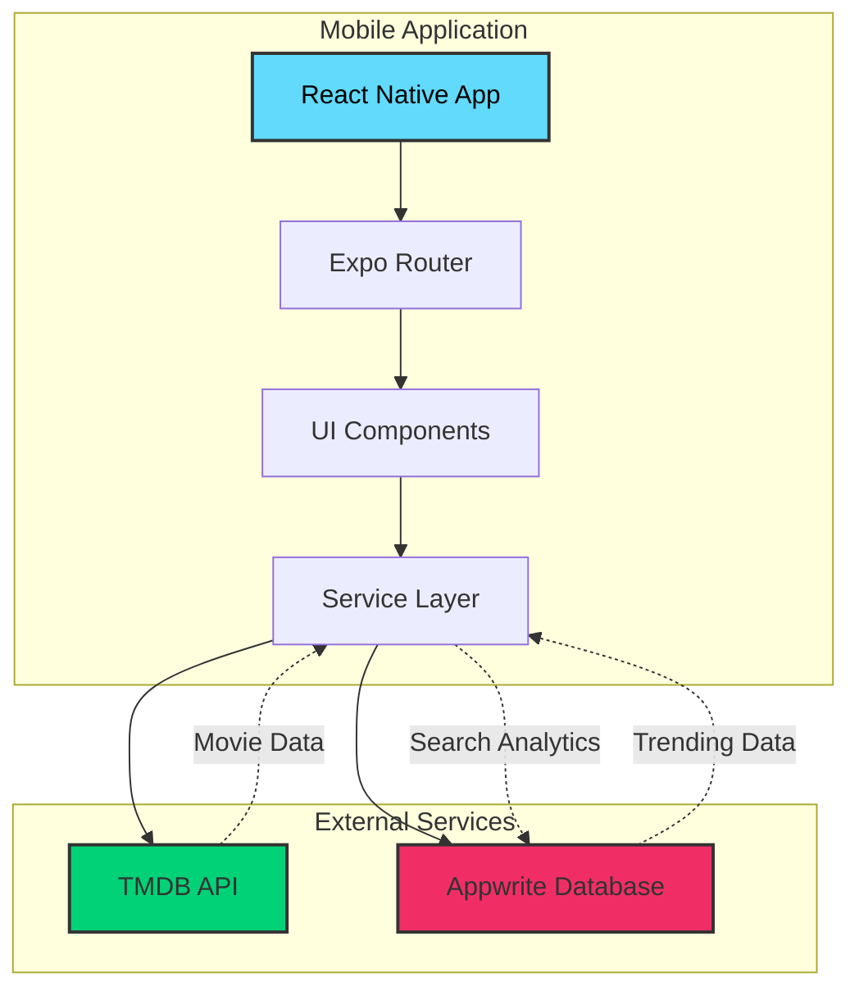
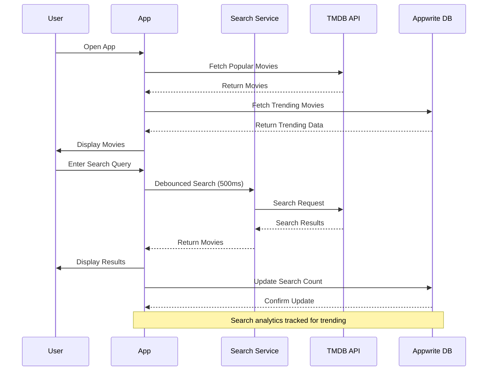
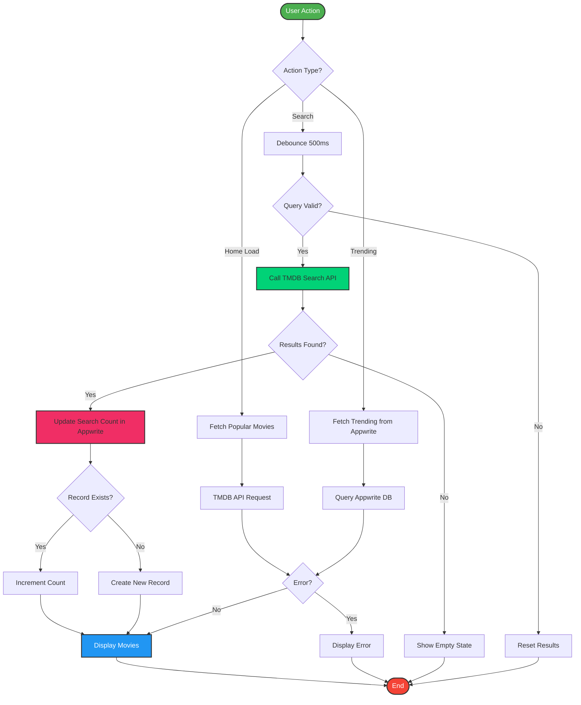
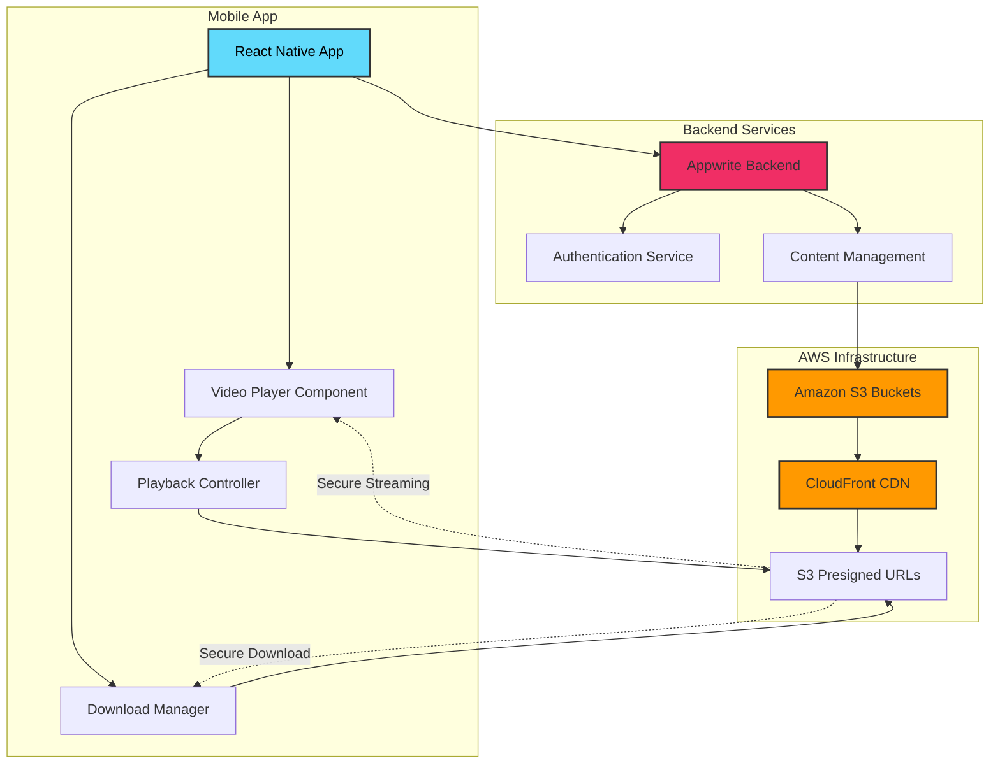

# 🎬 React Native Movie App

<div align="center">


**A beautiful, feature-rich mobile application for discovering and tracking movies**

[Features](#-features) • [Installation](#-installation) • [Usage](#-usage) • [Architecture](#-architecture)

</div>

---

## 📱 Overview

React Native Movie App is a modern, cross-platform mobile application that leverages **The Movie Database (TMDB) API** to provide users with comprehensive movie information. Built with React Native and Expo, the app features a sleek UI powered by NativeWind (TailwindCSS), real-time trending analytics through Appwrite, and smooth animations for an exceptional user experience.

### ✨ Key Highlights

- 🎯 **Real-time trending movies** based on user search patterns
- 🔍 **Intelligent search** with debouncing and analytics tracking
- 🎨 **Beautiful UI/UX** with smooth animations and gradients
- 📊 **Search analytics** powered by Appwrite database
- 🌐 **Cross-platform** support (iOS, Android, Web)
- ⚡ **Fast performance** with optimized data fetching

---

## 🚀 Features

| Feature               | Description                                                                             |
| --------------------- | --------------------------------------------------------------------------------------- |
| **Movie Discovery**   | Browse popular and latest movies from TMDB with high-quality posters and details        |
| **Advanced Search**   | Search for any movie with debounced input for optimized API calls                       |
| **Trending Movies**   | View the most searched movies in a horizontal scrollable carousel                       |
| **Search Analytics**  | Automatically track search queries and build trending lists using Appwrite              |
| **Movie Details**     | View comprehensive movie information including ratings, release dates, and descriptions |
| **Responsive Design** | Beautiful UI that adapts to different screen sizes and orientations                     |
| **Smooth Animations** | Engaging animations powered by React Native Reanimated                                  |
| **Tab Navigation**    | Intuitive bottom tab navigation for easy app exploration                                |
| **Error Handling**    | Graceful error handling with user-friendly messages                                     |
| **Loading States**    | Activity indicators for better user feedback during data fetching                       |

---

## 🏗️ Architecture



### System Components

- **Mobile Application**: Built with React Native and Expo, featuring file-based routing via Expo Router
- **UI Layer**: NativeWind-styled components with Reanimated animations
- **Service Layer**: API integration services and custom hooks for data fetching
- **TMDB API**: External movie database providing comprehensive movie information
- **Appwrite Database**: Backend-as-a-Service for search analytics and trending data

---

## 🔄 Data Flow



---

## 🛠️ Tech Stack

| Category             | Technology                   | Version | Purpose                               |
| -------------------- | ---------------------------- | ------- | ------------------------------------- |
| **Framework**        | React Native                 | 0.81.5  | Cross-platform mobile development     |
| **Runtime**          | Expo                         | 54.0.0  | Development framework and build tools |
| **Language**         | TypeScript                   | 5.3.3   | Type-safe JavaScript                  |
| **Routing**          | Expo Router                  | 6.0.19  | File-based navigation system          |
| **Styling**          | NativeWind                   | 4.1.23  | TailwindCSS for React Native          |
| **Styling**          | TailwindCSS                  | 3.4.17  | Utility-first CSS framework           |
| **Backend**          | Appwrite                     | 0.19.0  | BaaS for database and analytics       |
| **API**              | TMDB API                     | v3      | Movie database and information        |
| **Animations**       | React Native Reanimated      | 3.16.0  | Smooth, performant animations         |
| **Gestures**         | React Native Gesture Handler | 2.28.0  | Touch gesture handling                |
| **Icons**            | React Native Heroicons       | 4.0.0   | Beautiful icon set                    |
| **Navigation**       | React Navigation             | 7.0.14  | Navigation infrastructure             |
| **State Management** | React Hooks                  | Native  | Built-in state management             |

---

## 📂 Project Structure

```
react-native-movie-app/
├── 📁 app/                          # Application screens and routes
│   ├── 📁 (tabs)/                   # Tab-based navigation screens
│   │   ├── index.tsx                # Home screen (Trending & Latest)
│   │   └── search.tsx               # Search screen
│   ├── 📁 movie/                    # Movie detail screens
│   │   └── [id].tsx                 # Dynamic movie detail page
│   ├── _layout.tsx                  # Root layout configuration
│   └── globals.css                  # Global styles
├── 📁 components/                   # Reusable UI components
│   ├── MovieCard.tsx                # Movie grid card component
│   ├── SearchBar.tsx                # Search input component
│   └── TrendingCard.tsx             # Trending movie carousel card
├── 📁 services/                     # Business logic and API services
│   ├── api.ts                       # TMDB API integration
│   ├── appwrite.ts                  # Appwrite database operations
│   └── usefetch.ts                  # Custom data fetching hook
├── 📁 constants/                    # App constants and assets
│   ├── icons.ts                     # Icon exports
│   └── images.ts                    # Image exports
├── 📁 interfaces/                   # TypeScript type definitions
├── 📁 types/                        # Additional type declarations
├── 📁 assets/                       # Static assets (images, fonts)
├── .env                             # Environment variables
├── app.json                         # Expo configuration
├── package.json                     # Dependencies
├── tailwind.config.js               # TailwindCSS configuration
└── tsconfig.json                    # TypeScript configuration
```

---

## 📋 Prerequisites

Before you begin, ensure you have the following installed:

- **Node.js** (v18 or higher) - [Download](https://nodejs.org/)
- **npm** or **yarn** - Package manager
- **Expo CLI** - Install globally: `npm install -g expo-cli`
- **Git** - Version control
- **TMDB Account** - [Sign up](https://www.themoviedb.org/signup) for API access
- **Appwrite Account** - [Sign up](https://appwrite.io/) for backend services

### Mobile Development Requirements

- **iOS Development**: macOS with Xcode installed
- **Android Development**: Android Studio with Android SDK
- **Expo Go App**: Install on your mobile device for testing

---

## 🔧 Installation

### 1. Clone the Repository

```bash
git clone https://github.com/yourusername/react-native-movie-app.git
cd react-native-movie-app
```

### 2. Install Dependencies

```bash
npm install
# or
yarn install
```

### 3. Set Up Environment Variables

Create a `.env` file in the root directory:

```bash
touch .env
```

Add the following environment variables:

```env
EXPO_PUBLIC_MOVIE_API_KEY=your_tmdb_api_key_here
EXPO_PUBLIC_APPWRITE_PROJECT_ID=your_appwrite_project_id
EXPO_PUBLIC_APPWRITE_DATABASE_ID=your_appwrite_database_id
EXPO_PUBLIC_APPWRITE_COLLECTION_ID=your_appwrite_collection_id
EXPO_PUBLIC_APPWRITE_ENDPOINT=https://cloud.appwrite.io/v1
```

### 4. Get TMDB API Key

1. Go to [TMDB Website](https://www.themoviedb.org/)
2. Create an account or log in
3. Navigate to: **Settings** → **API** → **Request API Key**
4. Choose "Developer" option
5. Fill in the required details
6. Copy your **API Read Access Token (v4 auth)** - this is a Bearer token
7. Paste it in your `.env` file as `EXPO_PUBLIC_MOVIE_API_KEY`

### 5. Set Up Appwrite Backend

#### Create Appwrite Project

1. Go to [Appwrite Console](https://cloud.appwrite.io/)
2. Create a new project
3. Copy the **Project ID** to your `.env` file

#### Create Database

1. In your Appwrite project, navigate to **Databases**
2. Click **"Create Database"**
3. Name it (e.g., "MovieAppDB")
4. Copy the **Database ID** to your `.env` file

#### Create Collection

1. Inside your database, click **"Create Collection"**
2. Name it **"movies"**
3. Copy the **Collection ID** to your `.env` file (or use "movies" directly)

#### Configure Collection Attributes

Add the following attributes to your collection:

| Attribute Name | Type    | Size | Required |
| -------------- | ------- | ---- | -------- |
| `searchTerm`   | String  | 255  | Yes      |
| `movie_id`     | Integer | -    | Yes      |
| `title`        | String  | 500  | Yes      |
| `count`        | Integer | -    | Yes      |
| `poster_url`   | String  | 1000 | No       |

#### Set Permissions

1. Go to **Settings** → **Permissions**
2. Add the following permissions for **"Any"** role:
   - ✅ Read
   - ✅ Create
   - ✅ Update

---

## 🎯 Usage

### Start the Development Server

```bash
npm start
# or
expo start
```

### Run on Specific Platforms

```bash
# iOS Simulator (macOS only)
npm run ios

# Android Emulator
npm run android

# Web Browser
npm run web
```

### Using Expo Go

1. Install **Expo Go** app on your iOS or Android device
2. Scan the QR code from your terminal
3. The app will load on your device

---

## 🔌 API Integration Flow



---

## 📱 App Features Guide

### Home Screen

- **Trending Movies**: Horizontal scrollable carousel showing the top 5 most searched movies
- **Latest Movies**: Grid view of popular/latest movies from TMDB
- **Search Bar**: Tap to navigate to the search screen

### Search Screen

- **Real-time Search**: Type to search for movies with debounced API calls
- **Search Results**: Display results in a 3-column grid
- **Empty States**: Helpful messages when no results are found
- **Analytics**: Each search is tracked to build trending data

### Movie Details (Future Enhancement)

- Tap on any movie card to view detailed information
- View ratings, release date, overview, and more

---

## 🚀 Future Roadmap

We're continuously working to enhance the React Native Movie App with exciting new features. Here's what's planned for upcoming releases:

### 🎥 Video Streaming & Download Feature

> [!IMPORTANT]
> The following features are currently in the planning phase and will be implemented in future releases.

#### Planned Capabilities

| Feature                   | Description                                                         | Status     |
| ------------------------- | ------------------------------------------------------------------- | ---------- |
| **Movie Streaming**       | Stream full-length movies directly in the app with adaptive quality | 🔜 Planned |
| **Web Series Support**    | Browse and stream complete web series with episode tracking         | 🔜 Planned |
| **Offline Downloads**     | Download movies and episodes for offline viewing                    | 🔜 Planned |
| **Multi-Quality Options** | Choose from 480p, 720p, 1080p, and 4K streaming                     | 🔜 Planned |
| **Resume Playback**       | Continue watching from where you left off                           | 🔜 Planned |
| **Subtitle Support**      | Multi-language subtitle integration                                 | 🔜 Planned |
| **Watch History**         | Track viewing progress and history                                  | 🔜 Planned |

#### 📦 Amazon S3 Integration

The streaming and download features will be powered by **Amazon S3** for reliable, scalable media storage and delivery:

**Architecture Overview:**



**Key Implementation Details:**

1. **Content Storage**

   - Movies and web series will be stored in Amazon S3 buckets
   - Organized folder structure: `/movies/{movie_id}/`, `/series/{series_id}/season_{n}/episode_{n}/`
   - Multiple quality versions stored for each video

2. **Secure Access**

   - Pre-signed URLs for authenticated access
   - Time-limited download links (24-hour expiry)
   - User authentication via Appwrite before generating S3 URLs

3. **Content Delivery**

   - Amazon CloudFront CDN for global, low-latency streaming
   - Adaptive bitrate streaming based on network conditions
   - Edge caching for improved performance

4. **Download Management**
   - Background downloads with resume capability
   - Download queue management
   - Storage optimization with auto-cleanup of old downloads

#### 🛠️ Technology Stack Additions

| Technology                   | Purpose                          | Version |
| ---------------------------- | -------------------------------- | ------- |
| **AWS SDK for React Native** | S3 integration and API calls     | Latest  |
| **React Native Video**       | Video playback component         | Latest  |
| **react-native-fs**          | File system access for downloads | Latest  |
| **Amazon CloudFront**        | CDN for video delivery           | -       |
| **Amazon S3**                | Video storage and hosting        | -       |

#### 📋 Implementation Phases

**Phase 1: Basic Streaming (Q1 2026)**

- [ ] Set up Amazon S3 buckets for video storage
- [ ] Configure CloudFront distribution
- [ ] Implement video player with basic playback controls
- [ ] Add authentication and presigned URL generation
- [ ] Support for 720p streaming

**Phase 2: Advanced Features (Q2 2026)**

- [ ] Multi-quality streaming (480p, 720p, 1080p, 4K)
- [ ] Download functionality with progress tracking
- [ ] Resume playback from last position
- [ ] Subtitle support with multiple languages
- [ ] Watch history and continue watching

**Phase 3: Web Series Integration (Q3 2026)**

- [ ] Web series browsing and discovery
- [ ] Episode listing and navigation
- [ ] Season management
- [ ] Binge-watching features (auto-play next episode)
- [ ] Series progress tracking

**Phase 4: Optimization & Enhancement (Q4 2026)**

- [ ] Adaptive bitrate streaming
- [ ] Offline mode improvements
- [ ] Picture-in-Picture support
- [ ] Chromecast integration
- [ ] Advanced analytics and recommendations

#### 💡 Additional Planned Features

- **Watchlist**: Save movies and series for later viewing
- **Personalized Recommendations**: AI-powered content suggestions based on viewing history
- **Social Features**: Share favorite movies and reviews with friends
- **Parental Controls**: Content filtering and viewing restrictions
- **Cross-device Sync**: Continue watching across multiple devices

> [!NOTE]
> These features require additional infrastructure setup including AWS account, S3 buckets, CloudFront configuration, and content licensing agreements. Timeline may vary based on development priorities and resource availability.

---

## 🎨 Customization

### Modify Theme Colors

Edit `tailwind.config.js`:

```javascript
module.exports = {
  theme: {
    extend: {
      colors: {
        primary: "#your-color",
        accent: "#your-accent-color",
      },
    },
  },
};
```

### Change App Icon and Splash Screen

1. Replace images in `assets/images/`
2. Update paths in `app.json`

---

## 🐛 Troubleshooting

### Common Issues

| Issue                                 | Solution                                                          |
| ------------------------------------- | ----------------------------------------------------------------- |
| **Metro bundler error**               | Clear cache: `npx expo start -c`                                  |
| **Reanimated errors**                 | Ensure `babel.config.js` includes reanimated plugin               |
| **Appwrite 401 errors**               | Check collection permissions allow Any role to Read/Create/Update |
| **TMDB API errors**                   | Verify API key is correct and has "Bearer" token format           |
| **Environment variables not working** | Restart the development server after changing `.env`              |

### Clear All Caches

```bash
# Clear Expo cache
npx expo start -c

# Clear npm cache
npm cache clean --force

# Clear watchman (macOS/Linux)
watchman watch-del-all

# Reinstall dependencies
rm -rf node_modules package-lock.json
npm install
```

---

## 🤝 Contributing

Contributions are welcome! Please follow these steps:

1. **Fork the repository**
2. **Create a feature branch**: `git checkout -b feature/YourFeature`
3. **Commit your changes**: `git commit -m 'Add YourFeature'`
4. **Push to the branch**: `git push origin feature/YourFeature`
5. **Open a Pull Request**

### Code Style Guidelines

- Use **TypeScript** for type safety
- Follow **Expo** and **React Native** best practices
- Use **functional components** with hooks
- Keep components **small and reusable**
- Add **comments** for complex logic
- Use **meaningful variable names**

---

## 📄 License

This project is licensed under the **MIT License** - see the [LICENSE](LICENSE) file for details.

---

## 🙏 Acknowledgments

- **[The Movie Database (TMDB)](https://www.themoviedb.org/)** - For providing comprehensive movie data
- **[Appwrite](https://appwrite.io/)** - For backend-as-a-service platform
- **[Expo](https://expo.dev/)** - For making React Native development easier
- **[NativeWind](https://www.nativewind.dev/)** - For bringing TailwindCSS to React Native
- **[React Native Community](https://reactnative.dev/)** - For the amazing ecosystem

---

## 📞 Support

If you encounter any issues or have questions:

- Open an [Issue](https://github.com/yourusername/react-native-movie-app/issues)
- Check the [Discussions](https://github.com/yourusername/react-native-movie-app/discussions)
- Review the [Documentation](https://docs.expo.dev/)

---

<div align="center">

**Made with ❤️ using React Native & Expo**

⭐ Star this repo if you find it helpful!

</div>
